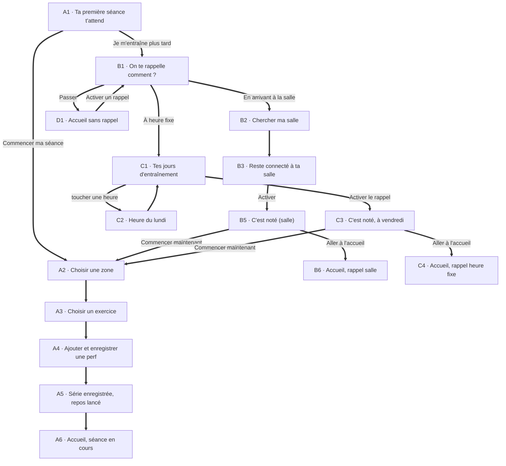

# One More · Flow post-inscription jusqu'à l'accueil

Ce dossier couvre uniquement ce qui se passe **juste après l'inscription**, jusqu'à l'arrivée sur l'accueil. Il sert de spec pour Cursor.

## Contenu

| Fichier | Rôle |
|:-|:-|
| `FLOW_INSCRIPTION.md` | Ce document : parcours, écrans, textes exacts, règles |
| `CURSOR_PROMPT.md` | Les prompts à coller dans Cursor |
| `maquettes/clair/*.png` et `maquettes/sombre/*.png` | Une capture par étape, nommée dans l'ordre du parcours |
| `prototype.html` | Prototype cliquable complet. Panneau de droite : scénarios "Inscription, je commence tout de suite", "Inscription, rappel sur mes jours", "Inscription, rappel à la salle" |
| `prototype-source.html` | Même prototype en source lisible, pour Cursor (images remplacées par des marqueurs) |

Le prototype est une **référence visuelle et fonctionnelle**. Ne pas copier son HTML : l'implémentation se fait avec les composants de `client/src` et les règles de `.cursor/rules`.

## Le parcours

## Les écrans

Tags : **Nouveau** (n'existe pas dans l'app), **Revu** (existe, à modifier), **Existant** (réutilisé tel quel).

### A1 · Ta première séance t'attend (Nouveau)
- Photo plein écran (athlète), titre "Ta première séance t'attend" (avec "séance t'attend" en lime).
- Texte : "Quelques minutes suffisent. Note ce que tu soulèves et regarde ta progression monter, séance après séance."
- 3 puces avec icône : "Choisis ton premier exercice", "Note ta série, le repos se lance", "Bats-toi la fois suivante".
- Bouton lime "Commencer ma séance" → A2. Lien gris "Je m'entraîne plus tard" → B1.

### A2 à A5 · Première séance (Existant + Revu)
- A2, A3 : l'onglet Exercices existant (zones puis catalogue).
- A4 : `AddPerfDrawer` existant, titre "Ajouter et enregistrer une perf".
- A5 : après "Enregistrer", toast "Séance lancée, ta série démarre" avec "+40 XP", le repos démarre et la barre de séance apparait au dessus de la nav.
- A6 : l'accueil affiche "Séance en cours" avec l'exercice, et la barre de séance (rangée exercice + rangée repos lime). Voir le HANDOFF principal pour la barre.

### B1 · On te rappelle comment ? (Nouveau)
- En haut : retour à gauche, "Passer" à droite (→ D1, sans rappel).
- Titre : "On te rappelle comment ?"
- Sous-titre : "Choisis ce qui colle à ta routine. Tu pourras changer ça dans Réglages."
- **Deux cartes cliquables, sans sélection ni bouton Continuer** : toucher une carte passe directement à l'étape suivante. Chaque carte a une icône, un titre, un texte, une puce et un chevron à droite.
  1. **En premier, "En arrivant à la salle"** (icône pin sur fond lime, c'est le choix mis en avant) : "Rien à régler : on détecte ton arrivée et on te notifie automatiquement." Puce "Idéal si tes horaires changent". → B2.
  2. **"À heure fixe"** (icône calendrier sur fond gris) : "Tu choisis tes jours et ton heure, on te notifie à ce moment-là." Puce "Idéal si tu as un planning régulier". → C1.

### B2, B3 · Salle (Existant)
- B2 "Chercher ma salle" : `GymSearchPicker` / `OnboardingGymStep` existants (liste, carte, salles près de moi).
- B3 "Reste connecté à ta salle" : `OnboardingGymPermissionsStep` existant (notifications + position). Le bouton du bas devient **"Activer"**, actif seulement quand les deux autorisations sont données (B4).

### C1 · Tes jours d'entraînement (Nouveau)
- Titre : "Tes jours d'entraînement". Sous-titre : "Active tes jours et règle l'heure de chacun. On te notifie à ce moment-là."
- Une carte avec les 7 jours (Lundi à Dimanche), une ligne par jour : interrupteur, nom du jour, et à droite :
  - jour actif : l'heure du jour dans une puce ("07:00 ⌄"), touchable ;
  - jour inactif : "Repos" en gris.
- **Chaque jour a sa propre heure.** Exemple par défaut : lundi 07:00, mercredi 12:30, vendredi 18:30.
- Bouton lime "Activer le rappel" → C3.
- Données : le modèle existe déjà (`ReminderSlot` = `weekday` + `hour` + `minute` dans `lib/reminder-schedule.ts`). Un créneau par jour actif.

### C2 · Heure du lundi (Nouveau, composant existant)
- Tiroir ouvert en touchant l'heure d'un jour. Titre "Heure du lundi" (le jour touché).
- Le `TimePicker` existant : libellé "L'heure" avec la valeur choisie à droite, deux roues heures (00 à 23) et minutes (00 à 59), ":" au centre, "h" et "min" dessous. La valeur se met à jour pendant le défilement.
- Bouton "Valider" : enregistre l'heure de ce jour. Bouton secondaire "Appliquer à mes N jours" (affiché seulement s'il y a d'autres jours actifs) : copie cette heure sur tous les jours actifs.
- Toucher en dehors ferme sans rien changer.

### B5, C3 · C'est noté (Revu)
- Salle (B5) : titre "C'est noté", texte "On te notifie dès que tu arrives à [nom de la salle], même app fermée." Carte "Rappel activé" avec le nom de la salle.
- Heure fixe (C3) : titre "C'est noté, à [prochain jour]", texte "On te notifie [prochain jour] à [heure] pour ta prochaine séance." Carte "Rappel activé" avec le résumé "Lun 07:00 · mer 12:30 · ven 18:30".
- Puis la liste : "Ta série démarre dès ta première séance", "Tes potes verront tes perfs", "7 jours de série = ton t-shirt One More". Et la carte "Déjà à la salle ? Pas besoin d'attendre le rappel, lance ta séance maintenant."
- Boutons : "Commencer maintenant" (lime, → A2) et "Aller à l'accueil" (→ B6 ou C4).

### B6, C4, D1 · Accueil d'un nouvel inscrit (Revu)
- En-tête, carte niveau 1 (0 / 100 XP), semaine avec "Auj." souligné.
- Carte photo sombre "Ta première séance" selon le rappel :
  - salle (B6) : pastille "Rappel activé", "On te notifie en arrivant à la salle", "[salle]. Déjà sur place ? Lance-toi, 1 exercice suffit.", bouton "Modifier mon rappel" (translucide, sans bordure) ;
  - heure fixe (C4) : pastille "Rappel activé", "On te notifie vendredi à 18:30", "Pas besoin d'attendre : 1 exercice et 1 série suffisent pour lancer ta série.", "Modifier mon rappel" ;
  - sans rappel (D1) : pastille "Pas de rappel", "On te prévient quand ?", "Choisis tes jours ou ta salle, on te rappelle au bon moment.", bouton lime "Activer un rappel" (→ B1).
- Bouton fixe noir "Démarrer une séance" au dessus de la nav.

## Consignes pour Cursor

1. **Réutiliser l'existant** : `OnboardingPage` et ses étapes (`OnboardingGymStep`, `OnboardingGymPermissionsStep`, `OnboardingNotificationsStep`), `GymSearchPicker`, `TimePicker`, `ReminderScheduleFields`, `AddPerfDrawer`, `EmptyState`, `BottomNav`, et `lib/reminder-schedule.ts` (`ReminderSlot`). Ne créer un composant que s'il n'existe pas (l'écran A1, l'écran B1, la liste des jours C1).
2. **Respecter `.cursor/rules`** : `copywriting-french.mdc`, `typography.mdc`, `accent-contrast.mdc`, `animations.mdc`, `mobile-safe-area.mdc`, `openpanel-tracking.mdc`.
3. **Textes exacts** : reprendre mot pour mot les textes de ce document et du prototype, en français, sans tiret double.
4. **Interactions** : B1 sans sélection (une carte = une navigation). C2 utilise le `TimePicker` à roues, pas un champ texte.
5. **Données réelles** : rappel salle = salle choisie + autorisations ; rappel heure fixe = un `ReminderSlot` par jour actif avec son heure. Le texte de C3 et de l'accueil se calcule à partir du prochain créneau.
6. **Tracking OpenPanel** : vue de chaque étape, choix fait en B1 (salle, heure fixe, passer), autorisations accordées ou refusées, rappel activé, "Commencer maintenant" vs "Aller à l'accueil".
7. **Thème sombre** : utiliser les tokens (`bg-card`, `bg-secondary`, `text-foreground`, `text-muted-foreground`, `border-border`) et non des couleurs en dur. Les captures `maquettes/sombre/` montrent le rendu attendu. Texte toujours noir sur fond lime.
8. **Navigation** : retour possible à chaque étape (flèche en haut à gauche). "Passer" et "Je m'entraîne plus tard" ne bloquent jamais l'accès à l'app.
9. **Un lot = une PR**, testée sur iOS et Android : (1) A1 et B1, (2) branche salle B2 à B6, (3) branche heure fixe C1 à C4 avec le `TimePicker`, (4) accueil nouvel inscrit B6, C4, D1.
